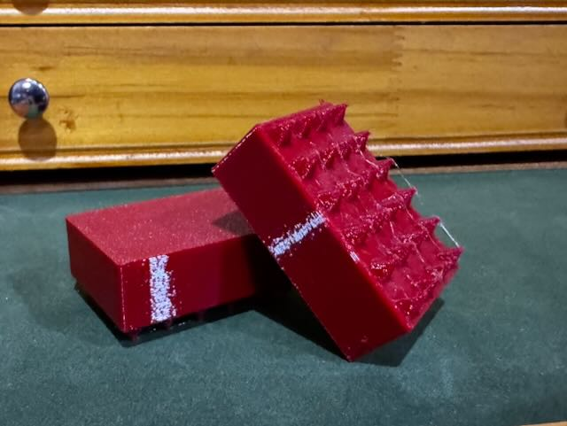
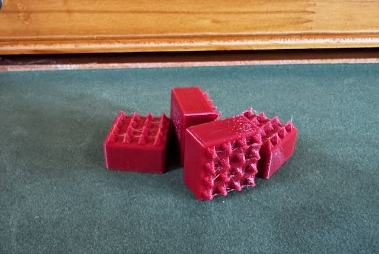

# Carpet Riser Foot

A 3D model to create a riser foot with spikes to hold it in place on a carpet.

I was mounting some components on floor of my Jeep. I had two use cases: one was to level out a component due to the contours of the Jeep floor. The other was to mount a component to the floor, but wanted risers to encourage airflow to keep the component cool.

This project uses OpenSCAD to create a cuboid that has carpet spikes on on face of it. In my case I used VHB tape to affix is to the components being supported.

## Model Parameters

This model has the following parameters that you can use to customize it.

| Parameter         | Description                                                                       |
| ----------------- | --------------------------------------------------------------------------------- |
| foot_height       | Foot height in the z direction. This dimension does not include the carpet teeth. |
| foot_width        | Width of the foot in the x direction.                                             |
| foot_depth        | Depth of the foot in the y direction.                                             |
| teeth_rows_x      | Number of rows for teeth in the x direction (width)                               |
| teeth_cols_y      | Number of columns for teeth in the y direction (depth)                            |
| min_teeth_spacing | Minimum spacing needed between teeth                                              |

All values are in millimeters. The size of the teeth is driven by the number of the rows, columns and the dimensions of the foot.

## Dependencies and Using the Component

This model is built using the tools listed below and must be installed in order to customize the model.

- [OpenSCAD](https://openscad.org)
- [The Belfry OpenScad Library, v2.0.](https://github.com/BelfrySCAD/BOSL2)

The `*.stl` files are rendered objects with the dimensions in the file name.
The `*.3mf` file is an [Orca Slicer](https://orcaslicer.com) project file.

## Example Output

50x35x16mm carpet riser foot.

20x20x10mm carpet riser foot.

